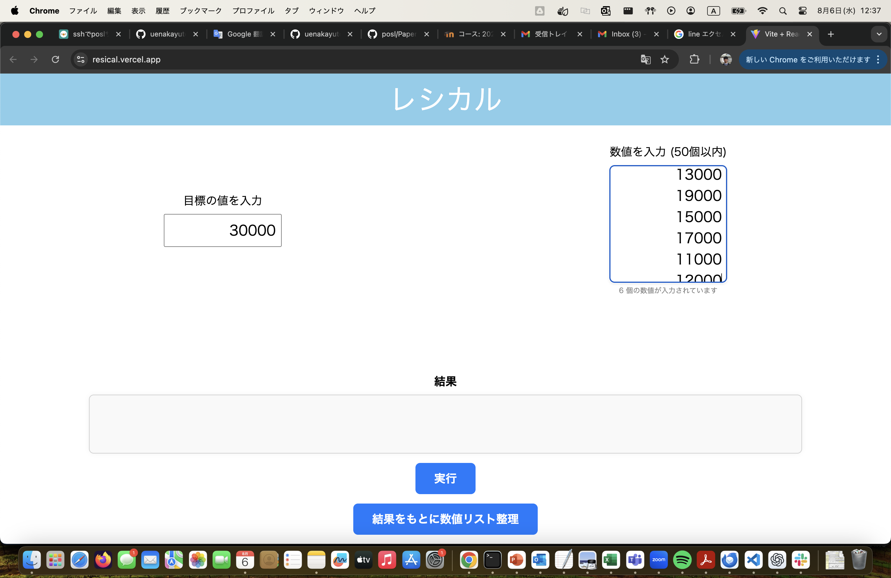
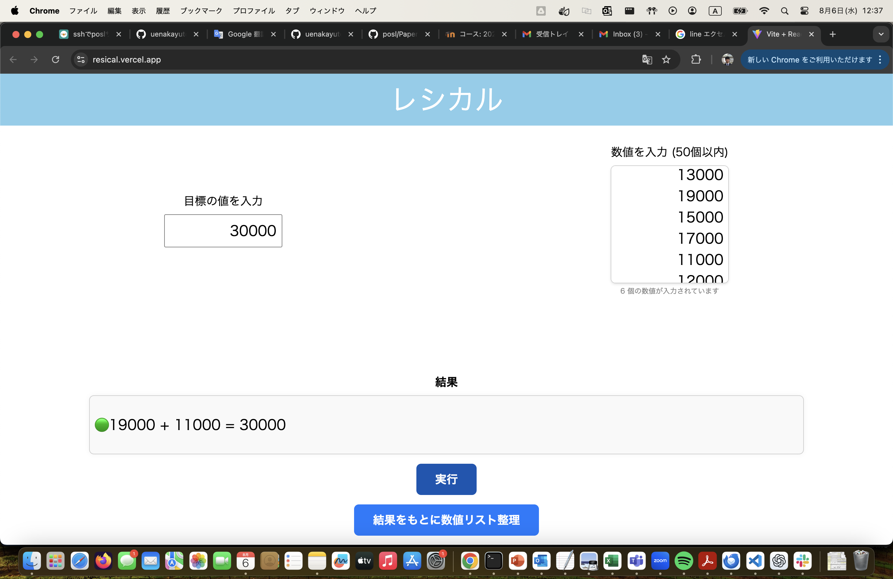

# レシート計算用 Web アプリ

## アプリ URL
[https://resical.vercel.app/](https://resical.vercel.app/)  
※PCからのアクセスを推奨

---

## アプリ概要
大量のレシートの中から，**合計が指定額になる組み合わせ**を高速に見つけるアプリです．  
もし**ぴったりの組み合わせが存在しない場合**は，**指定額を超える最小の合計額**を返します．  

---

## 使い方

1. **「目標の値を入力」** に指定額を入力し，  
   **「数値を入力 (25個以内)」** に各レシートの額を改行区切りで入力します．  
   

2. **「実行」** ボタンを押すと，最適な組み合わせを表示します．  
   

3. **「結果をもとに数値リスト整理」** ボタンを押すと，直前の実行で使われたレシート額をリストから自動で削除します．  
   （手作業での削除は不要！）  
   

4. 整理後に再び **「実行」** ボタンを押すと，別の組み合わせを探索できます．  
   

5. **ぴったりの組み合わせが見つからない場合**は，指定額を超える最小合計額の組み合わせを表示します．  
   

---

## 開発のきっかけ
大学1年の冬，実家で母から「このレシートの束から2万円を超える組み合わせを探して」と頼まれたのが始まりです．  
当時はプログラミングの経験がほぼなく，手動で計算するしかありませんでしたが，この作業は非常に骨が折れました．  

大学でプログラミングを学ぶ中で，この作業を自動化できることに気づき，まずはローカルで動くプログラムを作成．  
しかし，初期バージョンは探索効率が悪く，大きなデータでは時間がかかる課題がありました．  

そこで**アルゴリズムを見直し，探索を効率化**したうえで，**いつでもどこでも使える Web アプリ**として公開しました．

---

## 技術的な工夫

### アルゴリズム
- **深さ優先探索（DFS）** による全探索
- **降順ソート** により，大きい値から順に試すことで早期枝刈りが可能
- **最大値から算出した探索深さの下限** により，無駄な探索を減らす
- 部分和が **指定額を超えたら即枝刈り**
- 残りの数値をすべて足しても指定額に届かない場合は，その枝をスキップ（suffix sumによる見込み判定）

### フロント・バックエンド構成
- **フロントエンド**：React（Vercelデプロイ）
- **バックエンド**：FastAPI（Renderデプロイ）
- CORS対応でフロント・バック間通信を許可